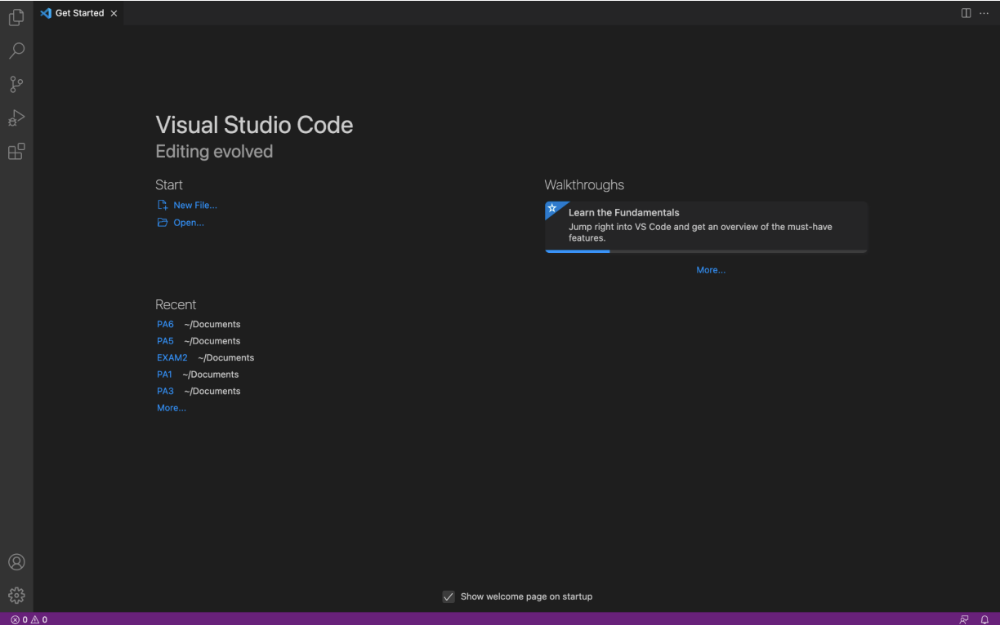

# Lab Report 1 - Week 2

Hello viewers!

Today's main topic will be about how to **access machines or computers remotely**; specifically connecting to computers in the UCSD basement lab by logging into the course-specific account `ieng6` remotely using our own device. Cool idea right?!

So now, I will be demonstrating *6 steps* to complete this magical process:

1. Installing Visual Studio Code
- Visit the [Visual Studio Code](https://code.visualstudio.com/) website to download and install VSCode onto the computer. 
- Once installed and opened, the home page of VSCode should look something like the image below:

2. Remotely Connecting
- In VSCode, open a terminal by going to tab `Terminal` on the top bar and click on `New Terminal`
![VSCode Terminal](
- 
4. Running Some Commands
5. Moving files with `scp`
6. Setting an SSH key
7. Optimizing Remote Running
